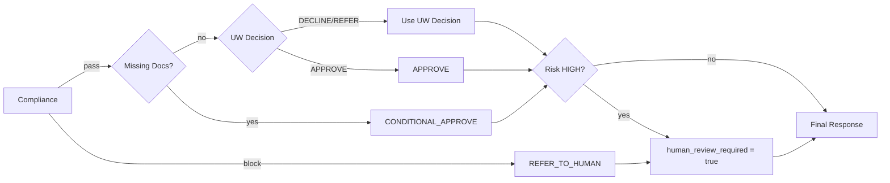
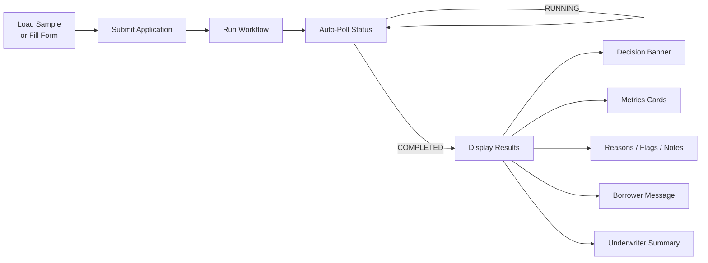

# Mortgage Loan Origination — Azure AI Foundry Multi-Agent Demo

> **DISCLAIMER:** This project is a **synthetic demo only**. It does not perform
> real mortgage underwriting, does not connect to credit bureaus, and must not be
> used for actual lending decisions.

## Architecture

```mermaid
flowchart TD
    subgraph Client
        FE[Web UI - Frontend]
        A[Borrower / LOS UI]
    end

    subgraph Azure App Service
        FE2[Static Frontend - index.html]
        B[POST /applications]
        C[POST /applications/id/run]
        D[GET /applications/id/status]
    end

    subgraph Azure AI Foundry — New Agents API
        WF[MortgageLoanOrigination Workflow]
        O[OrchestratorAgent]
        I[IntakeAgent]
        DOC[DocumentAgent]
        UW[UnderwritingAgent]
        R[RiskAgent]
        CO[ComplianceAgent]
        CM[CommsAgent]
    end

    FE -->|Open browser| FE2
    FE2 -->|Submit JSON| B
    FE2 -->|Trigger| C
    FE2 -->|Poll| D
    A -->|Submit JSON| B
    A -->|Trigger| C
    A -->|Poll| D

    C -->|code orchestration| I

    I -->|intake_result| DOC
    DOC -->|docs_result| UW
    UW -->|uw_result| R
    R -->|risk_result| CO
    CO -->|compliance_result| O
    O -->|decision| CM

    CM -->|Final JSON| D

    style O fill:#4A90D9,color:#fff
    style I fill:#7BC67E,color:#fff
    style DOC fill:#7BC67E,color:#fff
    style UW fill:#7BC67E,color:#fff
    style R fill:#E8A838,color:#fff
    style CO fill:#E8A838,color:#fff
    style CM fill:#7BC67E,color:#fff
```

### Agent Descriptions

| Agent | Role |
|---|---|
| **OrchestratorAgent** | Primary coordinator. Calls specialist agents in sequence, applies decision logic, enforces JSON output. |
| **IntakeAgent** | Validates & normalises application fields. Flags missing/invalid data. |
| **DocumentAgent** | Checks required docs (W2, paystub, bank statement, ID, purchase contract). Extracts key facts. |
| **UnderwritingAgent** | Computes DTI, LTV, residual income. Applies simplified Conventional/FHA rules. |
| **RiskAgent** | Flags fraud signals: name mismatches, income inconsistencies, unusual deposits, short tenure. |
| **ComplianceAgent** | Enforces fair-lending safe language. Blocks if protected-class reasoning detected. |
| **CommsAgent** | Generates borrower-facing message and technical underwriter summary. |

### Decision Flow



## Repository Structure

```
BerkadiaDemo/
├── README.md
├── .env.sample
├── .gitignore
├── requirements.txt
├── deploy.ps1                          # One-click Azure deployment script
├── startup.sh                          # App Service startup command
├── data/
│   └── samples/
│       ├── application_1.json          # Good credit, all docs present
│       ├── application_2.json          # FHA, missing docs, higher DTI
│       ├── application_3.json          # Human-in-the-loop: name mismatch + large deposit
│       ├── docs_metadata.json          # Document inventory for both apps
│       └── sample_doc_texts/
│           ├── W2_2025.txt
│           ├── paystub_feb2026.txt
│           ├── bank_statement_jan2026.txt
│           ├── drivers_license.txt
│           └── purchase_contract.txt
├── src/
│   ├── __init__.py
│   ├── api/
│   │   ├── __init__.py
│   │   ├── main.py                     # FastAPI endpoints + Responses API calls
│   │   └── models.py                   # Pydantic schemas
│   └── foundry/
│       ├── __init__.py
│       ├── create_agents.py            # Provisions agents via REST API (POST /agents)
│       ├── run_workflow.py             # CLI runner (Responses API)
│       ├── agent_ids.json              # Generated agent names (gitignored)
│       └── workflow/
│           └── mortgage_workflow.yaml  # Workflow reference definition
├── frontend/
│   └── index.html                      # Single-page web UI for testing
├── tests/
│   ├── __init__.py
│   ├── test_smoke.py                   # Smoke tests (schema + API)
│   └── eval_cases.jsonl                # Evaluation test cases
└── infra/
    └── main.bicep                      # Bicep template (AI Foundry + App Service)
```

## Prerequisites

- **Python 3.11+**
- **Azure subscription** with access to Azure AI Foundry
- **Azure CLI** (`az login` authenticated)
- **VS Code** with Azure AI Foundry extension (optional, for portal integration)

## Setup Instructions

### 1. Create an Azure AI Foundry Project

The Bicep template (see [Infrastructure Deployment](#infrastructure-deployment-optional))
creates the Foundry resource, project, **and** deploys the gpt-4o model automatically.
No Hub is required — the template uses the new `Microsoft.CognitiveServices/accounts`
resource with `allowProjectManagement: true`.

Alternatively, you can create a project manually:

1. Go to [https://ai.azure.com](https://ai.azure.com).
2. Click **+ New project**.
3. Give it a name (e.g., `mortgage-demo`).
4. Deploy **gpt-4o** from the Model catalog.
5. Note the **Foundry endpoint** from the project **Overview** page.

### 2. Configure Environment

```bash
cd BerkadiaDemo
cp .env.sample .env
```

Edit `.env`:

```env
PROJECT_ENDPOINT=https://<foundry-name>.services.ai.azure.com/api/projects/<project-name>
MODEL_DEPLOYMENT=gpt-4o
```

### 3. Install Dependencies

```bash
python -m venv .venv
.venv\Scripts\activate        # Windows
# source .venv/bin/activate   # macOS/Linux

pip install -r requirements.txt
```

### 4. Authenticate with Azure

```bash
az login
```

The app uses `DefaultAzureCredential`, which picks up your Azure CLI login.
The token scope used is `https://ai.azure.com/.default`.

### 5. Create Agents in Foundry

```bash
python src/foundry/create_agents.py
```

This script:
1. Deletes any existing agents to allow clean re-creation.
2. Creates all **seven specialist agents** via the new Foundry Agents REST API (`POST /agents` with `definition.kind: "prompt"`).
3. Creates a **MortgageLoanOrigination workflow** (`definition.kind: "workflow"`) using the portal-compatible YAML schema (`trigger` + `actions` with `InvokeAzureAgent` steps).
4. Saves agent names to `src/foundry/agent_ids.json`.

Agents are created as **new Foundry agents** (not classic) and will appear in the
[Azure AI Foundry portal](https://ai.azure.com) under both the **Agents** and **Workflows** pages.

### 6. Start the API Server

```bash
uvicorn src.api.main:app --reload --host 0.0.0.0 --port 8000
```

The FastAPI server serves both the API and the frontend web UI.

### 7. Open the Web UI

Open **http://localhost:8000** in your browser to access the frontend application.

### 8. Run Tests

```bash
pytest tests/test_smoke.py -v
```

## Example API Calls

### Submit an application

```bash
curl -X POST http://localhost:8000/applications \
  -H "Content-Type: application/json" \
  -d @data/samples/application_1.json
```

**Response (201):**

```json
{
  "application_id": "APP-2026-00101",
  "status": "PENDING",
  "result": null
}
```

### Trigger the workflow

```bash
curl -X POST http://localhost:8000/applications/APP-2026-00101/run
```

**Response (200):**

```json
{
  "application_id": "APP-2026-00101",
  "status": "RUNNING",
  "result": null
}
```

### Check status / retrieve result

```bash
curl http://localhost:8000/applications/APP-2026-00101/status
```

**Example completed response:**

```json
{
  "application_id": "APP-2026-00101",
  "status": "COMPLETED",
  "result": {
    "application_id": "APP-2026-00101",
    "decision": "APPROVE",
    "human_review_required": false,
    "reasons": [
      "DTI 0.37 within conventional limit of 0.43",
      "LTV 0.79 within limit of 0.95",
      "FICO 742 meets minimum 680",
      "All required documents received"
    ],
    "missing_documents": [],
    "metrics": {
      "dti": 0.37,
      "ltv": 0.79,
      "monthly_income": 9500.0,
      "monthly_debt": 3512.0,
      "residual_income": 3996.0
    },
    "risk_flags": [],
    "compliance_notes": [
      "No protected-class references detected",
      "Decision based solely on creditworthiness factors"
    ],
    "borrower_message": "Great news! Your mortgage application has been approved. Your loan officer will contact you within 2 business days to discuss next steps and schedule your closing.",
    "underwriter_summary": "Application APP-2026-00101: APPROVE. DTI 37%, LTV 79%, FICO 742. All docs complete. No risk flags. Conventional 30yr fixed at 6.75% for $332,000 on $420,000 appraised value. Clean file – ready for closing."
  }
}
```

### Application 2 (FHA, missing docs)

```bash
curl -X POST http://localhost:8000/applications \
  -H "Content-Type: application/json" \
  -d @data/samples/application_2.json

curl -X POST http://localhost:8000/applications/APP-2026-00102/run
# ... wait a moment ...
curl http://localhost:8000/applications/APP-2026-00102/status
```

**Expected result:** `CONDITIONAL_APPROVE` with `missing_documents: ["BANK_STATEMENT", "PURCHASE_CONTRACT"]`.

### Application 3 (Human-in-the-Loop)

```bash
curl -X POST http://localhost:8000/applications \
  -H "Content-Type: application/json" \
  -d @data/samples/application_3.json

curl -X POST http://localhost:8000/applications/APP-2026-00103/run
# ... wait a moment ...
curl http://localhost:8000/applications/APP-2026-00103/status
```

**Expected result:** `REFER_TO_HUMAN` with `human_review_required: true`. The borrower name on the application ("Michael Robert Chen") differs from the W-2 ("Mike R. Chen"), and there is an unexplained $87,000 deposit. RiskAgent flags both issues as HIGH risk, triggering human review.

## Web UI

The project includes a single-page frontend at `frontend/index.html`, served
automatically at the root URL (`/`) by FastAPI.

### Features

| Feature | Description |
|---|---|
| **Form View** | Structured form with all application fields (borrower, property, loan, income, debts, credit, declarations). |
| **JSON Editor** | Raw JSON editing tab, syncs bidirectionally with the form. |
| **Sample Loader** | One-click buttons to load Application 1 (conventional, clean), Application 2 (FHA, missing docs), or Application 3 (risk flags, human-in-the-loop). |
| **Submit** | Sends `POST /applications` to register the application. |
| **Run Workflow** | Sends `POST /applications/{id}/run` to trigger the multi-agent pipeline. |
| **Auto-Poll** | Polls `GET /applications/{id}/status` every 3 seconds while the workflow is running. |
| **Results Panel** | Shows decision badge, DTI/LTV/income metrics, reasons, missing docs, risk flags, compliance notes. |
| **Messages** | Tabbed view of the borrower-facing message and technical underwriter summary. |
| **Activity Log** | Timestamped dark console panel showing all API interactions and status updates. |

### Web UI Flow



## CLI Runner (Alternative)

You can also run the workflow directly without the API:

```bash
python src/foundry/run_workflow.py data/samples/application_1.json
```

## Infrastructure Deployment

The Bicep template uses the new **hub-less** Foundry resource model
(`Microsoft.CognitiveServices/accounts` with `allowProjectManagement`).
All resources — including the gpt-4o model deployment and RBAC — are provisioned
automatically.

| Resource | Type | Purpose |
|---|---|---|
| AI Foundry | `Microsoft.CognitiveServices/accounts` | AI Services account with project management enabled |
| Foundry Project | `Microsoft.CognitiveServices/accounts/projects` | Mortgage demo project (child of Foundry resource) |
| gpt-4o Deployment | `Microsoft.CognitiveServices/accounts/deployments` | GlobalStandard model deployment (auto-provisioned) |
| Storage Account | `Microsoft.Storage/storageAccounts` | Workspace storage |
| Key Vault | `Microsoft.KeyVault/vaults` | Secrets management |
| App Service Plan | `Microsoft.Web/serverfarms` | Linux B1 plan for the web app |
| Web App | `Microsoft.Web/sites` | Python 3.11 App Service running uvicorn |
| RBAC Assignment | `Microsoft.Authorization/roleAssignments` | Grants the Web App's managed identity "Cognitive Services OpenAI User" on the Foundry resource |

### One-Click Deploy (Recommended)

The `deploy.ps1` script handles **everything** — infrastructure, agents, code
deployment, and opening the browser:

```powershell
.\deploy.ps1
```

Or with custom parameters:

```powershell
.\deploy.ps1 -ResourceGroup "my-rg" -Location "westus2" -ProjectName "berkadia"
```

**What it does (5 steps):**

1. Creates the Azure resource group
2. Deploys the Bicep template (AI Foundry, App Service, RBAC, model, etc.)
3. Creates all 7 Foundry agents + the MortgageLoanOrigination workflow
4. Zip-deploys the application code to App Service
5. Opens the web app in your browser

After deployment, wait ~60 seconds for the app to warm up, then test the agent
workflow from the web UI.

### Manual Deploy (Step by Step)

If you prefer to deploy manually:

#### 1. Deploy infrastructure

```bash
az group create --name rg-mortgage-demo --location eastus2

az deployment group create \
  --resource-group rg-mortgage-demo \
  --template-file infra/main.bicep \
  --parameters projectName=mortgage-demo
```

#### 2. Get deployment outputs

```bash
az deployment group show \
  --resource-group rg-mortgage-demo \
  --name main \
  --query properties.outputs
```

This returns `foundryEndpoint`, `foundryName`, `projectName`, `webAppName`, and `webAppUrl`.

> **Note:** The `PROJECT_ENDPOINT` app setting and RBAC role assignment are
> automatically configured during deployment. No manual setup needed.

#### 3. Create agents

```bash
# Set .env to point to the deployed project
echo "PROJECT_ENDPOINT=<projectEndpoint-from-output>" > .env
echo "MODEL_DEPLOYMENT=gpt-4o" >> .env

python src/foundry/create_agents.py
```

#### 4. Deploy code to App Service

```bash
az webapp up \
  --resource-group rg-mortgage-demo \
  --name <webAppName-from-output> \
  --runtime "PYTHON:3.11"
```

The web app will be available at the `webAppUrl` output
(e.g., `https://app-mortgage-demo-xxxxx.azurewebsites.net`).

#### 5. Test the UI

Open the `webAppUrl` in your browser. Load a sample application, click **Submit**,
then **Run Workflow** to test the full agent pipeline.

## Evaluation Cases

The file `tests/eval_cases.jsonl` contains five evaluation scenarios covering:

| Case | Scenario | Expected Decision |
|---|---|---|
| EVAL-001 | Good credit, all docs, low DTI | APPROVE |
| EVAL-002 | FHA, missing bank statement | CONDITIONAL_APPROVE |
| EVAL-003 | High DTI, high LTV, low FICO | DECLINE |
| EVAL-004 | Name mismatch + large deposit → risk HIGH | REFER_TO_HUMAN |
| EVAL-005 | FHA edge case, minimum FICO 580 | APPROVE |

## Key Design Decisions

1. **New Foundry Agents API**: Agents are created via `POST /agents` with `definition.kind: "prompt"` (not the classic `/assistants` endpoint). This ensures agents appear in the **new Agents experience** in the Azure AI Foundry portal, not under "Classic Agents".

2. **Responses API for execution**: Agent invocation uses the Foundry **Responses API** (`POST /openai/responses` with `agent_reference`) instead of the classic threads/messages/runs pattern. Each call is stateless — no thread management needed.

3. **Foundry Workflow**: A `MortgageLoanOrigination` workflow agent (`definition.kind: "workflow"`) is created alongside the specialists, making the multi-agent pipeline visible on the portal's **Workflows** page.

4. **Code-level orchestration**: The application code calls each specialist agent sequentially (Intake → Document → Underwriting → Risk → Compliance → Orchestrator → Comms) via the Responses API, collecting JSON outputs and feeding them forward.

5. **Human-in-the-loop**: When the decision is `REFER_TO_HUMAN`, `DECLINE`, or risk is `HIGH`, the response includes `human_review_required: true` and an `underwriter_summary` for the human reviewer.

   **Example — EVAL-004 (Name mismatch + large deposit):**

   In this scenario the borrower's W-2 name doesn't match the application and a
   large unexplained deposit appears in the bank statement. The agents react as
   follows:

   | Agent | Action |
   |---|---|
   | **IntakeAgent** | Validates and normalises the application — passes as VALID. |
   | **DocumentAgent** | All required documents present — status COMPLETE. |
   | **UnderwritingAgent** | DTI and LTV within conventional limits → preliminary APPROVE. |
   | **RiskAgent** | Detects `NAME_MISMATCH_W2` and `LARGE_UNEXPLAINED_DEPOSIT` → risk **HIGH**. |
   | **ComplianceAgent** | No protected-class references — status pass. |
   | **OrchestratorAgent** | Risk is HIGH → overrides to **REFER_TO_HUMAN**, sets `human_review_required: true`. |
   | **CommsAgent** | Generates a borrower message explaining additional review is needed and an underwriter summary detailing the risk flags. |

   The final response includes the risk flags and a detailed `underwriter_summary`
   so the human reviewer can quickly assess the case without re-reading the full
   application.

6. **Fair-lending compliance**: The ComplianceAgent is instructed to never reference protected classes and to block any decision that relies on prohibited factors.

7. **Structured JSON output**: Every agent is prompted to return strict JSON, and the API layer validates the final output against Pydantic schemas.

8. **Integrated web UI**: A single-page HTML/CSS/JS frontend served directly by FastAPI at `/`. No build step, no Node.js — just open the browser. The same App Service hosts both the API and the UI.

## API Integration Details

### Agent Creation (REST API)

```
POST {PROJECT_ENDPOINT}/agents?api-version=2025-05-15-preview

{
  "name": "IntakeAgent",
  "definition": {
    "kind": "prompt",
    "model": "gpt-4o",
    "instructions": "You are IntakeAgent ..."
  }
}
```

### Agent Invocation (Responses API)

```
POST {PROJECT_ENDPOINT}/openai/responses?api-version=2025-05-15-preview

{
  "model": "gpt-4o",
  "input": [{"role": "user", "content": "..."}],
  "agent_reference": {
    "type": "agent_reference",
    "name": "IntakeAgent",
    "version": "1"
  }
}
```

### Workflow Creation

```
POST {PROJECT_ENDPOINT}/agents?api-version=2025-05-15-preview

{
  "name": "MortgageLoanOrigination",
  "definition": {
    "kind": "workflow",
    "workflow": "kind: Workflow\ntype: sequential\nsteps:\n  - agent: IntakeAgent\n  - agent: DocumentAgent\n  ..."
  }
}
```

## License

This project is provided as-is for demonstration purposes. Not licensed for production use.
